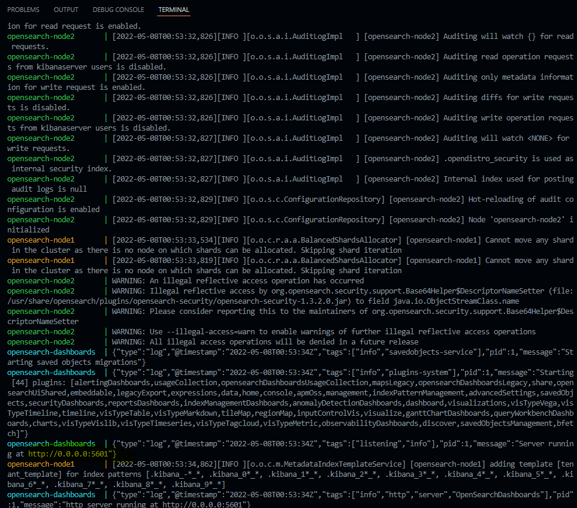
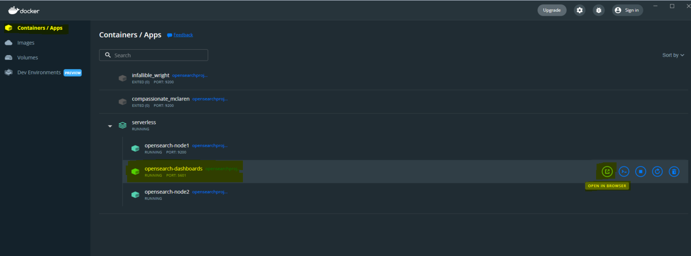
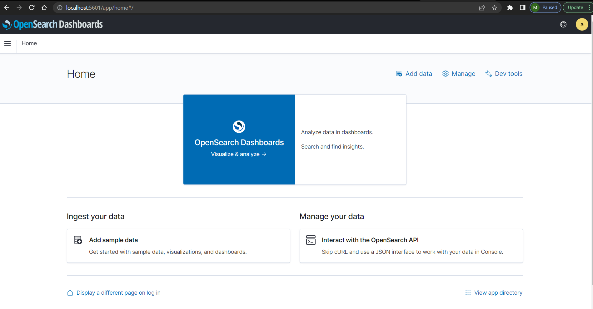

<h2>Installing Opensearch Docker Image</h2>

#### Where to find the Docker image?
To find a Docker image of opensearch, please go to the following website:
*https://www.opensearch.org/downloads.html*

Here are the required steps to follow:

- Download docker-compose.yml
- Setup your Docker host environment
- Run docker-compose up
- Run docker-compose up
- Navigate to_ _http://localhost:5601/_ _ for OpenSearch Dashboards
- Login with the default username (_admin_) and password (_admin_)

As soon as your _docker-compose up_ command on your terminal successfully gets executed you will see the output illustrated in the following image.



To get access to the Opensearch Dashboard on your desired browser, please navigate to _http://localhost:5601/app/login?nextUrl=%2F_ .

#### Browser compatibility
OpenSearch Dashboards supports the following web browsers:

- Chrome
- Firefox
- Safari
- Edge (Chromium)

Other Chromium-based browsers might work, as well. Internet Explorer and Microsoft Edge Legacy are not supported.

The Login page looks like the following image.


Another way to get access to this Login page is by opening docker application and hitting _OOPEN IN BROWSER_ icon on _opensearch-dashboards_ docker image.



As you log into dashboard, you'll see the main page as shown in the following picture.




```python

```
